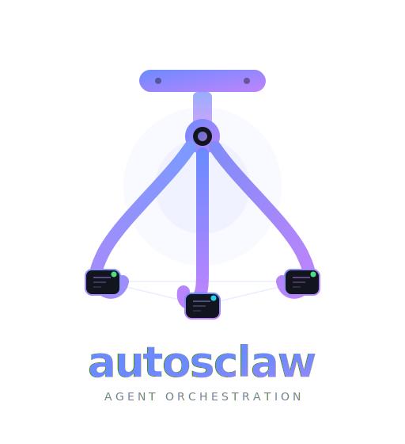

<div align="center">



### Autonomous AI Agent Orchestration Platform

*Spawn, schedule, and orchestrate autonomous Claude-powered agents — each in its own Docker container — from a real-time web dashboard.*

<br>

[](https://github.com/BreuerFlorian/autosclaw/stargazers)
[](https://www.typescriptlang.org/)
[](https://nodejs.org/)
[](https://www.docker.com/)
[](https://www.anthropic.com/)
[](https://react.dev/)

</div>

---

<br>

## Table of Contents

- [What is autosclaw?](#what-is-autosclaw)
- [Core Functionality](#core-functionality)
- [Architecture](#architecture)
- [Getting Started (AI-Assisted Setup)](#getting-started-ai-assisted-setup)
- [Configuration](#configuration)
- [How It Works](#how-it-works)
- [Security](#security)
- [API Reference](#api-reference)
- [Tech Stack](#tech-stack)
- [Project Structure](#project-structure)
- [Contributing](#contributing)
- [License](#license)

<br>

## What is autosclaw?

**autosclaw** is a self-hosted platform that turns Claude into an army of autonomous agents. Each agent runs in its own isolated Docker container with full tool access — they can write code, browse the web, manage files, interact with GitHub, and even **spawn other agents** to delegate work.

From the real-time web dashboard, you watch agents think, act, and collaborate. You see every tool invocation, every token spent, every dollar of cost — live. Schedule agents to run on cron expressions for recurring tasks like daily reports, repository maintenance, or automated code reviews. Or spawn them on-demand and let them loose.

What makes autosclaw unique is its **multi-agent orchestration**: agents aren't isolated workers — they're a network. Any agent can spawn, list, and manage other agents through MCP tools, enabling complex multi-step workflows where agents coordinate, delegate, and build on each other's work. All while you watch from a single pane of glass.

<br>

## Core Functionality

### Autonomous AI Agents

Each agent gets its own Docker container running Claude Opus 4.6 with the full Claude Code toolset:

- **Code execution** — Bash, file read/write/edit, glob, grep
- **Web access** — web search, web fetch, browsing
- **Development tools** — Git, GitHub CLI (`gh`), plan mode, worktrees
- **Agent orchestration** — spawn sub-agents, manage schedules, delegate work
- **Human-in-the-loop** — agents can pause and ask you questions mid-task, then continue with your answer

### Multi-Agent Orchestration via MCP

Agents form an interconnected network through 10 MCP (Model Context Protocol) tools:

| Tool | Description |
|------|-------------|
| `spawn_agent` | Spawn a child agent with inherited permissions |
| `list_agents` | List all running agents (with `isSelf` flag) |
| `despawn_agent` | Stop an agent (cannot despawn self) |
| `create_schedule` | Create a cron-based recurring or one-time schedule |
| `list_schedules` | List all schedules |
| `get_schedule` | Get details of a specific schedule |
| `update_schedule` | Modify an existing schedule |
| `pause_schedule` | Pause an active schedule |
| `resume_schedule` | Resume a paused schedule |
| `delete_schedule` | Soft-delete a schedule |

Key design decisions:
- **Recursive spawning** — agents spawn children, which spawn grandchildren, and so on
- **Permission inheritance** — child agents automatically inherit their parent's permissions
- **Safety guardrails** — agents cannot despawn themselves or agents already stopping

### Real-Time Dashboard

A React 19 progressive web app that streams everything live over WebSocket:

- **Live output** — watch agent text, collapsible thinking blocks, and system messages as they happen
- **Tool cards** — structured display of every tool invocation with syntax-highlighted inputs and diffs
- **Interactive chat** — jump into any running agent's session at any time to provide guidance, course-correct, or give additional instructions mid-task
- **Ask-user flow** — agents can pause for user input; you get a push notification and see selectable options in the dashboard
- **Sortable tables** — sort agents and schedules by any column (name, status, tokens, cost)
- **Bulk actions** — select multiple agents and stop them in one click
- **Agent history** — browse output and tool logs for stopped or deleted agents
- **PWA support** — installable on mobile/desktop, push notifications, offline-ready service worker

### Cron Scheduling

Automate recurring work with cron-powered scheduling:

- **Recurring schedules** — standard 5-field cron expressions (UTC timezone)
- **One-time schedules** — fire once and auto-delete
- **Pause / resume** — temporarily disable schedules without deleting them
- **Custom agent config** — each schedule defines the spawned agent's name, purpose, and system prompt
- **Permission scoping** — schedules inherit the creator's permissions
- **30-second tick** — the scheduler checks and fires every 30 seconds

### Cost & Token Tracking

Full visibility into what your agents are spending:

- **Per-agent breakdown** — input tokens, output tokens, cache read, cache creation, and USD cost
- **Live updates** — token counters update in real-time as agents work
- **Usage dashboard** — paginated table of all agents sorted by cost, with totals
- **Summary cards** — at-a-glance totals for running agents, total agents, and schedules

### Role-Based Access Control

Three roles with granular permissions:

| Role | Capabilities |
|------|-------------|
| **Admin** | Full control: manage all agents, schedules, users, reload service |
| **Member** | Create and manage your own agents and schedules |
| **Viewer** | Read-only access to the dashboard |

Agents also receive granular permissions (`agent:spawn`, `agent:schedule`) that propagate down the hierarchy to child agents.

<br>

## Architecture

autosclaw consists of three main components: the **Manager** (host process), **Agent containers** (Docker), and the **Dashboard** (React UI). They communicate over WebSocket for real-time streaming and REST for control operations.

```
┌──────────────────────────────────────────────────────────────────────┐
│                      Web Dashboard (React 19 + Vite)                 │
│                                                                      │
│    Live output streaming    Sortable agent/schedule tables           │
│    Tool invocation cards    Token & cost tracking                    │
│    Interactive chat         Push notifications (PWA)                 │
│    Role-based UI            Ask-user question flow                   │
└─────────────────────────────┬────────────────────────────────────────┘
                              │ WebSocket (/ws) — JWT authenticated
                              ▼
┌──────────────────────────────────────────────────────────────────────┐
│                        MANAGER  (Host)                               │
│                                                                      │
│  ┌────────────┐  ┌─────────────┐  ┌─────────────┐  ┌────────────┐  │
│  │  Express 5  │  │  WebSocket  │  │  SQLite DB  │  │    Cron    │  │
│  │  REST API   │  │   Servers   │  │  (WAL mode) │  │  Scheduler │  │
│  │             │  │             │  │             │  │             │  │
│  │ /api/spawn  │  │ /ws   (UI)  │  │ • agents    │  │ 30s tick   │  │
│  │ /api/agents │  │ /agent      │  │ • messages  │  │ recurring  │  │
│  │ /api/despawn│  │  (agents)   │  │ • users     │  │ one-time   │  │
│  │ /api/sched. │  │             │  │ • schedules │  │ auto-spawn │  │
│  │ /api/push   │  │ Broadcast   │  │ • config    │  │            │  │
│  │ /api/health │  │ to watchers │  │ • push_subs │  │            │  │
│  └────────────┘  └──────┬──────┘  └─────────────┘  └────────────┘  │
│                          │                                           │
│  SECURITY LAYER          │  Docker CLI: docker run / stop / rm      │
│  ├── JWT auth (bcrypt + 24h tokens)                                  │
│  ├── Per-agent hex tokens (timing-safe comparison)                   │
│  ├── RBAC (admin / member / viewer)                                  │
│  ├── Secrets via stdin (never on disk or in env vars)                │
│  └── Post-startup secret scrubbing from process.env                  │
│                                                                      │
│  RESILIENCE                                                          │
│  ├── 30s health check reconciliation loop                            │
│  ├── Orphan container detection and cleanup                          │
│  └── Graceful shutdown (15s timeout → force exit)                    │
│                                                                      │
└──┬───────────────────────────────────────────────────────────────────┘
   │
   │  WebSocket (/agent) + secrets via stdin
   ▼
┌──────────────────────────────────────────────────────────────────────┐
│                       DOCKER CONTAINERS                              │
│                                                                      │
│  ┌──────────────────┐  ┌──────────────────┐  ┌──────────────────┐   │
│  │   Agent #1        │  │   Agent #2        │  │   Agent #N       │   │
│  │                   │  │                   │  │                  │   │
│  │  Claude Agent SDK │  │  Claude Agent SDK │  │  Claude Agent    │   │
│  │  (Opus 4.6)       │  │  (Opus 4.6)       │  │  SDK (Opus 4.6) │   │
│  │                   │  │                   │  │                  │   │
│  │  Built-in tools:  │  │  MCP tools:       │  │  Permissions     │   │
│  │  Bash, Read,      │  │  spawn_agent      │  │  inherited from  │   │
│  │  Write, Edit,     │  │  list_agents      │  │  parent          │   │
│  │  Grep, Glob,      │  │  despawn_agent    │  │                  │   │
│  │  WebSearch,       │  │  schedule CRUD    │  │  git, gh CLI     │   │
│  │  WebFetch, Agent  │  │  (7 tools)        │  │                  │   │
│  └──────────────────┘  └──────────────────┘  └──────────────────┘   │
│           ▲                     ▲                     ▲              │
│           └─────────────────────┴─────────────────────┘              │
│                    Agent-to-Agent Orchestration                       │
└──────────────────────────────────────────────────────────────────────┘
```

### Component Responsibilities

**Manager** (`manager/src/`) — the central orchestrator running on the host:

| Module | Responsibility |
|--------|---------------|
| `main.ts` | Express app init, Docker image build, agent restoration on startup, 30s health check loop, graceful shutdown |
| `api.ts` | REST API routes for spawning/despawning agents and schedule CRUD, dual auth (JWT + agent tokens) |
| `auth.ts` | User registration/login, JWT generation/verification, password hashing (bcryptjs), role management |
| `communication.ts` | Two WebSocket servers — `/ws` for the dashboard and `/agent` for agent containers — message routing, permission checks, project management |
| `containers.ts` | Docker container lifecycle: image building, agent spawning (with stdin secret delivery), stopping, orphan cleanup |
| `db.ts` | SQLite schema and CRUD for agents, messages, schedules, users, projects, and config (WAL mode, soft deletes) |
| `schedules.ts` | Cron scheduler: 30-second tick loop, next-run computation, auto-spawn on match, one-time schedule cleanup |
| `push.ts` | Web Push notifications via VAPID keys for agent completion, errors, input requests, and schedule triggers |
| `logger.ts` | Structured JSON logging with file rotation (10 MB max, 5 files) |

**Agent** (`agent/src/`) — runs inside each Docker container:

| Module | Responsibility |
|--------|---------------|
| `main.ts` | Entrypoint: reads secrets from stdin, creates MCP server with 10 tools, runs Claude Agent SDK session, scrubs secrets from process.env |
| `manager-client.ts` | WebSocket client to manager: registration, output/token/tool-use streaming, ask-user flow, spawn requests (60s timeout) |
| `types.ts` | SDK message type helpers for display formatting |

**Dashboard** (`manager/ui/src/`) — React 19 single-page app:

| Module | Responsibility |
|--------|---------------|
| `context/AppContext.tsx` | Global state (agents, schedules, projects, outputs) via React Context + Reducer, WebSocket connection lifecycle |
| `hooks/` | `useAuth` (JWT mgmt), `useAutoScroll` (smart scrolling), `useConfirmDialog`, `usePushNotifications`, `useTableSort` |
| `components/dashboard/` | Main view: SummaryCards, AgentTable, ScheduleTable, AgentUsageTable, ProjectsPanel |
| `components/agent/` | Agent detail: OutputArea (text/thinking), ToolCard (syntax-highlighted), ChatBar, TokenBar, AskUserCard |
| `components/modals/` | NewAgentModal (spawn form), NewScheduleModal (cron config), ConfirmDialog |

### Communication Protocol

**Agent ↔ Manager** (WebSocket `/agent`):

| Direction | Message Type | Purpose |
|-----------|-------------|---------|
| Agent → Manager | `register` | Authenticate with agent ID and token |
| Agent → Manager | `output` | Text output (text, thinking, result, system) |
| Agent → Manager | `tool_use` | Tool invocation details |
| Agent → Manager | `tokens` | Token usage and cost update |
| Agent → Manager | `spawn_agent` | Request to spawn a child agent |
| Agent → Manager | `ask_user` | Pause and request user input |
| Manager → Agent | `chat` | Message from user via dashboard |
| Manager → Agent | `ask_user_response` | User's answer to a pending question |
| Manager → Agent | `close` | Shutdown order |

**Dashboard ↔ Manager** (WebSocket `/ws`): The manager broadcasts `agent_list` and `schedule_list` on every state change, and streams `output`, `tool_use`, `tokens`, and `ask_user` events in real-time to watchers.

### Data Model

SQLite (WAL mode) with the following tables:

| Table | Key Fields |
|-------|-----------|
| `agents` | id, name, token, purpose, system_prompt, cost_usd, input/output/cache tokens, status, permissions, project_id |
| `messages` | agent_id, role, msg_type (text/tool_use), text, metadata (JSON) |
| `schedules` | id, name, cron_expression, schedule_type (recurring/once), agent config, status, next_run_at |
| `users` | id, username, password_hash, role (admin/member/viewer) |
| `projects` | id, name, purpose, github_token |
| `config` | key/value pairs (VAPID keys, etc.) |
| `push_subscriptions` | endpoint, keys_p256dh, keys_auth |

All deletions are soft deletes (preserving audit history).

<br>

## Getting Started (AI-Assisted Setup)

autosclaw includes an **AI-assisted setup experience** powered by a Claude Code custom skill. Instead of manually configuring environment variables and running build steps, Claude walks you through the entire process interactively — checking prerequisites, generating secrets, and configuring everything for you.

### Prerequisites

- **Node.js** 22+
- **Docker** (running and accessible)
- **GitHub CLI** (`gh`) ([install](https://cli.github.com/))
- **Anthropic API Key** ([get one here](https://console.anthropic.com/))
- **Claude Code** ([install](https://docs.anthropic.com/en/docs/claude-code/overview))

### Setup

1. **Clone the repository**

```bash
gh repo clone BreuerFlorian/autosclaw
cd autosclaw
```

2. **Run the AI-assisted setup**

Open Claude Code in the project directory and run the setup skill:

```
/setup
```

Claude will interactively guide you through:
- Verifying prerequisites (Node.js, npm, Docker)
- Building the agent Docker image
- Configuring your `.env` file (API key, admin credentials, JWT secret, optional settings)
- Installing manager dependencies
- Building the React dashboard
- Starting the manager
- Optionally installing a systemd service for auto-start on boot

The setup skill handles secret generation, input validation, and error recovery — you just answer the prompts.

### Manual Setup (Alternative)

If you prefer to set up manually without AI assistance:

1. Build the agent Docker image:
```bash
cd agent && docker build -t autosclaw-agent . && cd ..
```

2. Create a `.env` file in the project root:
```env
ANTHROPIC_API_KEY=sk-ant-...
ADMIN_USERNAME=admin
ADMIN_PASSWORD=your-secure-password
JWT_SECRET=your-jwt-secret
GH_TOKEN=ghp_...              # Optional: enables GitHub self-modification
```

3. Install and run:
```bash
cd manager && npm install && cd ui && npm install && npm run build && cd .. && npm start
```

The dashboard is now running at `http://localhost:4000`.

### Systemd Service (Optional)

For production/server deployments, install as a systemd user service:

```bash
./install.sh
```

This creates `autosclaw-manager.service` that auto-starts on boot, restarts on failure, and runs in the background. Management commands:

```
systemctl --user status autosclaw-manager
systemctl --user restart autosclaw-manager
journalctl --user -u autosclaw-manager -f
```

<br>

## Configuration

### Environment Variables

| Variable | Default | Description |
|----------|---------|-------------|
| `ANTHROPIC_API_KEY` | *required* | Your Anthropic API key for Claude |
| `ADMIN_USERNAME` | — | Username for the initial admin account (seeded on first run) |
| `ADMIN_PASSWORD` | — | Password for the initial admin account |
| `JWT_SECRET` | random | Secret for signing JWT tokens. Set this for persistent sessions across restarts |
| `PORT` | `4000` | Port the manager server listens on |
| `MANAGER_HOST` | auto-detected | Docker bridge gateway IP. Auto-detected on Linux via `ip route` |
| `ALLOW_REGISTRATION` | `false` | Set to `true` to enable user self-registration |
| `LOG_LEVEL` | `info` | Logging verbosity (`debug`, `info`, `warn`, `error`) |
| `LOG_DIR` | — | Directory for log files (with automatic rotation at 10 MB, keeps 5 files) |
| `GH_TOKEN` | — | GitHub personal access token. Gives agents the ability to interact with GitHub repositories — clone, push, open PRs, and self-modify the autosclaw codebase itself |

### Self-Modification with `GH_TOKEN`

When you provide a `GH_TOKEN` in your `.env`, agents gain full GitHub access through the `gh` CLI. This enables a powerful self-modification capability: agents can clone the autosclaw repository, make changes to its own codebase, commit, push, and open pull requests — effectively allowing the platform to improve itself.

Use cases include:
- Agents that refactor or extend autosclaw's own source code
- Automated code review and PR creation on any repository
- Scheduled agents that maintain repositories (dependency updates, changelog generation)
- Multi-agent workflows where one agent writes code and another reviews it via GitHub

The token is delivered to agent containers securely via stdin (same as all other secrets) and scrubbed from `process.env` after startup.

<br>

## How It Works

### Agent Lifecycle

1. **Spawn** — You spawn an agent from the dashboard (or an agent spawns a child via MCP). The Manager generates a UUID and a unique 32-byte hex token, then runs `docker run` to create a new container from the `autosclaw-agent` image.

2. **Secret delivery** — The API key, manager URL, agent token, and optional GitHub token are piped to the container via **stdin**. They never touch disk or container environment variables. After the SDK subprocess starts, all secrets are scrubbed from `process.env`.

3. **Registration** — The agent connects back to the Manager via WebSocket, authenticates with its token, and begins its autonomous Claude session with the configured system prompt.

4. **Execution** — The agent runs autonomously, executing tools (Bash, file operations, web search, git) and reporting output, tool invocations, and token usage to the Manager in real-time.

5. **Orchestration** — Through MCP tools, the agent can spawn child agents, create schedules, list running agents, and despawn agents — enabling recursive multi-agent workflows with inherited permissions.

6. **Live guidance** — You can jump into any running agent's session at any time via the dashboard chat. Send instructions, course-correct, or provide context — the agent incorporates your message and continues. When the agent itself needs input, it sends an `ask_user` message with selectable options, and you get a push notification.

7. **Completion** — When the agent finishes (or is stopped), the container exits and is auto-removed (`--rm`). The Manager detects the exit, updates the database, and broadcasts the state change to the dashboard.

### Scheduling

The Manager's cron scheduler ticks every 30 seconds. For each active schedule whose `next_run_at` has passed, it spawns an agent with the schedule's configured name, purpose, system prompt, and permissions. One-time schedules are auto-deleted after firing.

### State Persistence

All state is stored in SQLite (WAL mode). On startup, the Manager reconciles its database with running Docker containers — restoring active agents and cleaning up orphans (containers without a matching DB entry, or DB entries without a running container).

<br>

## Security

### Secret Management

Secrets are piped to containers via **stdin only** — never stored in environment variables, CLI arguments, Docker labels, or on disk. After the Claude SDK subprocess starts, the agent scrubs `ANTHROPIC_API_KEY`, `CLAUDE_CODE_OAUTH_TOKEN`, `GITHUB_TOKEN`, `AGENT_TOKEN`, and others from `process.env`, preventing leakage through `/proc`, environment dumps, or child processes.

### Authentication

- **User auth** — username/password login produces a 24-hour JWT. Passwords hashed with bcryptjs (10 rounds).
- **Agent auth** — each container gets a unique 32-byte hex token verified with `crypto.timingSafeEqual` (timing-safe comparison).
- **Dual auth middleware** — every API endpoint accepts either a user JWT or an agent token with appropriate permission checks.

### Container Isolation

Every agent runs in a separate Docker container with `--rm` (auto-cleaned on exit). No host filesystem access, no privileged mode, no shared volumes.

### Resilience

- **30-second reconciliation loop** — detects and cleans up orphan containers
- **Graceful shutdown** — stops all agents, closes WebSockets, waits 15 seconds before force-exit
- **Structured logging** — JSON-formatted logs with request IDs and automatic file rotation
- **Soft deletes** — agents and schedules are never hard-deleted, preserving audit history

### Input Validation

All user inputs are validated at the API boundary: agent names (255 chars), purposes (1,000 chars), system prompts (100,000 chars), chat messages (50,000 chars), and cron expressions (validated with `cron-parser`).

<br>

## API Reference

### REST API

All `/api/*` endpoints require `Authorization: Bearer <token>` (JWT or agent token).

| Method | Endpoint | Description |
|--------|----------|-------------|
| `GET` | `/api/health` | Health check (no auth required) |
| `POST` | `/api/spawn` | Spawn a new agent container |
| `POST` | `/api/despawn` | Stop and remove an agent |
| `GET` | `/api/agents` | List all agents |
| `GET` | `/api/schedules` | List all schedules |
| `POST` | `/api/schedules` | Create a new schedule |
| `GET` | `/api/schedules/:id` | Get schedule details |
| `PUT` | `/api/schedules/:id` | Update a schedule |
| `DELETE` | `/api/schedules/:id` | Soft-delete a schedule |
| `POST` | `/api/schedules/:id/pause` | Pause a schedule |
| `POST` | `/api/schedules/:id/resume` | Resume a paused schedule |
| `POST` | `/api/push/subscribe` | Subscribe to push notifications |
| `POST` | `/api/push/unsubscribe` | Unsubscribe from push notifications |
| `GET` | `/api/push/subscriptions` | List push subscriptions |

### Authentication Endpoints

| Method | Endpoint | Description |
|--------|----------|-------------|
| `POST` | `/auth/login` | Authenticate and receive JWT (24h expiry) |
| `POST` | `/auth/register` | Register a new user (when `ALLOW_REGISTRATION=true`) |
| `GET` | `/auth/me` | Verify the current token |

### WebSocket Endpoints

| Endpoint | Purpose |
|----------|---------|
| `/ws?token=<jwt>` | Dashboard — real-time agent list, output streaming, cost updates |
| `/agent` | Agent-to-Manager — registration, message relay, token usage, spawn requests |

<br>

## Tech Stack

| Layer | Technology | Purpose |
|-------|-----------|---------|
| **Runtime** | Node.js 22 + TypeScript 5.6 | Server runtime with type safety |
| **Server** | Express 5 | HTTP server and REST API |
| **Real-Time** | ws (WebSocket) | Bidirectional communication |
| **Database** | better-sqlite3 (WAL mode) | Embedded persistent storage |
| **Auth** | bcryptjs + jsonwebtoken | Password hashing + JWT tokens |
| **Scheduling** | cron-parser | Cron expression parsing and scheduling |
| **Notifications** | web-push (VAPID) | Push notifications to browsers and mobile |
| **Logging** | Custom JSON logger | Structured logs with file rotation |
| **AI** | @anthropic-ai/claude-agent-sdk | Autonomous Claude agent sessions |
| **Tools** | @modelcontextprotocol/sdk | MCP server for inter-agent orchestration |
| **Validation** | Zod 4 | Schema validation for MCP tool inputs |
| **Containers** | Docker (node:22-slim) | Isolated agent execution |
| **Frontend** | React 19 + Vite | Real-time dashboard UI |

<br>

## Project Structure

```
autosclaw/
│
├── install.sh                       # systemd user service installer
├── .env                             # Environment variables (created during setup)
│
├── .claude/
│   └── commands/
│       └── setup.md                 # AI-assisted setup skill for Claude Code
│
├── agent/                           # Agent — runs inside Docker containers
│   ├── Dockerfile                   # node:22-slim + git + gh CLI
│   ├── build.sh                     # Build helper: docker build -t autosclaw-agent .
│   ├── Claude.md                    # Agent behavior guidelines
│   ├── package.json                 # Dependencies: agent SDK, MCP SDK, ws, zod
│   ├── tsconfig.json
│   └── src/
│       ├── main.ts                  # Entrypoint: stdin secrets, MCP server, SDK session
│       ├── manager-client.ts        # WebSocket client connecting back to Manager
│       └── types.ts                 # SDK message types and display helpers
│
├── manager/                         # Manager — runs on the host
│   ├── start.sh                     # Full startup script (pull, install, build, run)
│   ├── package.json                 # Dependencies: express, ws, better-sqlite3, etc.
│   ├── tsconfig.json
│   ├── src/
│   │   ├── main.ts                  # Express app, Docker image build, agent restoration
│   │   ├── api.ts                   # REST API routes (/api/spawn, /api/agents, etc.)
│   │   ├── auth.ts                  # JWT authentication (/auth/login, /auth/register)
│   │   ├── communication.ts         # WebSocket servers (dashboard /ws + agent /agent)
│   │   ├── containers.ts            # Docker container lifecycle (spawn, stop, secrets)
│   │   ├── db.ts                    # SQLite schema and CRUD (agents, messages, schedules)
│   │   ├── env.ts                   # Environment variable loading and defaults
│   │   ├── logger.ts                # Structured JSON logging with file rotation
│   │   ├── push.ts                  # Web Push notification service (VAPID)
│   │   ├── pushRoutes.ts            # Push subscription API endpoints
│   │   └── schedules.ts             # Cron schedule engine (30s tick loop)
│   │
│   └── ui/                          # React dashboard (built into src/public/)
│       ├── index.html
│       ├── package.json             # React 19, Vite, TypeScript
│       └── src/
│           ├── App.tsx              # Root layout: sidebar + main panel
│           ├── context/
│           │   └── AppContext.tsx    # Global state (React Context + Reducer + WebSocket)
│           ├── hooks/               # useAuth, useAutoScroll, useConfirmDialog, etc.
│           └── components/
│               ├── auth/            # LoginOverlay
│               ├── layout/          # Sidebar, MobileHeader
│               ├── modals/          # NewAgentModal, NewScheduleModal, ConfirmDialog
│               ├── dashboard/       # Dashboard, AgentTable, ScheduleTable, TokenSummary
│               ├── agent/           # AgentHeader, OutputArea, ToolCard, ChatBar, TokenBar
│               ├── schedule/        # ScheduleDetail
│               ├── settings/        # NotificationSettings
│               ├── notifications/   # Toast, ToastContainer
│               └── pwa/             # InstallPrompt
```

<br>

## Contributing

Contributions are welcome! Here's how to get started:

1. Fork the repository (`gh repo fork BreuerFlorian/autosclaw --clone`)
2. Create a feature branch (`git checkout -b feature/amazing-feature`)
3. Commit your changes (`git commit -m 'Add amazing feature'`)
4. Push and open a Pull Request (`gh pr create --title 'Add amazing feature'`)

### Development Setup

For frontend development with hot reload:

```bash
cd manager/ui
npm install
npm run dev
```

The Vite dev server proxies API requests to `http://localhost:4000`, so make sure the manager is running.

<br>

## License

This project is maintained by [@BreuerFlorian](https://github.com/BreuerFlorian). Please check the repository for license information.

<br>

---

<div align="center">

**Built with [Claude Agent SDK](https://github.com/anthropics/claude-agent-sdk) by Anthropic**

*autosclaw — let your agents do the work.*

</div>
